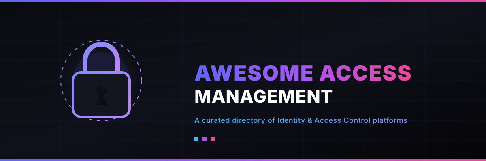

  

# Awesome Access Management & Identity Control Platforms 🔐

  
  
  

<!--
SEO Description: A curated list of awesome Access Management and Identity & Access Management (IAM) platforms. Compare top SaaS suites like Okta, Microsoft Entra ID, and Auth0 with modern open-source alternatives like Keycloak, Authentik, ZITADEL, Ory, and Authelia.
SEO Keywords: Access Management, Identity and Access Management, IAM, Open-Source IAM, Okta Alternative, Auth0 Alternative, Keycloak, Authentik, ZITADEL, SSO, MFA, User Lifecycle, Directory Services, SAML, OIDC, Access Control
-->

## 🔍 Similar Projects to Access Management Platforms

**Access Management / Identity and Access Management (IAM)** platforms provide Single Sign-On (SSO), multi-factor authentication (MFA), user lifecycle management, directory services, federation (SAML, OIDC), and fine-grained access control for workforce and customer identities. Leading commercial SaaS tools include Okta, Microsoft Entra ID, JumpCloud, OneLogin, Ping Identity, ForgeRock, Auth0, WorkOS, Frontegg, and ManageEngine ADSelfService Plus.

Below is a **curated list** of notable Access Management platforms and their open-source equivalents. The open-source ecosystem for identity and access management is mature and production-ready, with several projects serving as direct alternatives to commercial IAM suites.

## 🏢 SaaS / Hosted Platforms

| Platform | Description | Pricing / Starting Price | Free Tier Limit | Company Size (Est. Valuation / Revenue) |
| :--- | :--- | :--- | :--- | :--- |
| **[Microsoft Entra ID](https://www.microsoft.com/en-us/security/business/identity-access/microsoft-entra-id)** | Microsoft’s cloud identity and access management service, deeply integrated with Microsoft 365 and Azure. | Starts at ~$6/user/month (P1) | Free edition available (included with Azure/M365) / up to 50k MAUs for External ID | $4.0T Valuation / $100B+ Cloud Rev |
| **[Okta](https://www.okta.com/)** | Leading cloud identity platform for workforce and customer identity, SSO, MFA, and lifecycle management. | Starts at ~$6/user/month (requires $1,500/year minimum) | None (30-day trial available) | $11.0B Valuation / $3.0B ARR |
| **[Auth0](https://auth0.com/)** | Developer-friendly identity platform for authentication and authorization in applications. | Starts at ~$35/month (Essentials) | Up to 7,500 MAUs free | $6.5B Valuation (Acquired by Okta) |
| **[Ping Identity](https://www.pingidentity.com/)** | Enterprise identity security platform with strong federation and access management capabilities. | Starts at ~$3/user/month (Workforce Essential) | None (30-day trial available) | $2.8B Valuation (Acquired by Thoma Bravo) |
| **[JumpCloud](https://jumpcloud.com/)** | Cloud directory platform that unifies identity, access, and device management. | Starts at ~$9–$13/user/month | None (30-day trial available) | $2.6B Valuation |
| **[ForgeRock](https://www.forgerock.com/)** | Comprehensive identity platform for large-scale workforce and customer identity use cases. | Custom pricing | None (trial available upon request) | $2.3B Valuation (Acquired by Thoma Bravo) |
| **[WorkOS](https://workos.com/)** | Platform that helps SaaS companies add enterprise features (SSO, Directory Sync, etc.). | Starts at ~$125/connection/month | Free User Management (AuthKit) up to 1,000,000 MAUs | $2.0B Valuation |
| **[ManageEngine ADSelfService Plus](https://www.manageengine.com/products/self-service-password/)** | Self-service password management and identity-related tools, often used alongside Active Directory. | Starts at ~$595/year | Free for up to 50 domain users | $1.0B+ Revenue (Zoho Corp) |
| **[Frontegg](https://frontegg.com/)** | User management and authentication platform aimed at SaaS applications. | Custom / Tiered pricing | Free for up to 5 organizations | ~$200M Valuation |
| **[OneLogin](https://www.onelogin.com/)** | Cloud-based IAM solution focused on SSO, MFA, and directory integration. | Starts at ~$2–$8/user/month | None (30-day trial available) | ~$150M Valuation (Acquired by One Identity) |

## 🔓 Open-Source Software

### 🛡️ Full-Featured Identity Providers
- **[Keycloak](https://github.com/keycloak/keycloak)**  — The most mature and widely deployed open-source IAM solution (Apache 2.0). Supports OIDC, OAuth 2.0, SAML, LDAP/AD federation, fine-grained authorization, user federation, and social login. Backed by a large community (originally Red Hat).
- **[Authentik](https://github.com/goauthentik/authentik)**  — Modern, flexible open-source identity provider with excellent UX, forward-auth support, LDAP/SCIM, and strong self-hosting experience (MIT core).
- **[Ory](https://github.com/ory/hydra)**  (Hydra, Kratos, Oathkeeper, Keto) — Modular, cloud-native identity stack. Highly flexible and API-first; popular for teams that want to build custom identity experiences.
- **[SuperTokens](https://github.com/supertokens/supertokens-core)**  — Open-source authentication solution focused on developer experience, session management, and self-hosting (with optional managed cloud).
- **[ZITADEL](https://github.com/zitadel/zitadel)**  — Cloud-native, API-first identity platform with native multi-tenancy, event sourcing, and strong support for B2B SaaS use cases (Apache 2.0).

### ⚡ Lightweight & Specialized SSO / Auth Tools
- **[Authelia](https://github.com/authelia/authelia)**  — Lightweight authentication and authorization server designed for reverse-proxy SSO and 2FA (Apache 2.0). Excellent for protecting internal services.
- **[Logto](https://github.com/logto-io/logto)**  — Modern open-source CIAM / identity platform with great developer experience and pre-built UI components.
- **[Casdoor](https://github.com/casdoor/casdoor)**  — UI-first Identity and Access Management / SSO platform with support for multiple protocols.
- **[Kanidm](https://github.com/kanidm/kanidm)**  — Modern, secure identity management system written in Rust, focused on simplicity and security.

### 🏢 Enterprise & Directory-Focused
- **[FreeIPA](https://www.freeipa.org/)**  — Open-source identity management solution integrating LDAP, Kerberos, DNS, and certificate management (common in Linux environments).
- **[WSO2 Identity Server](https://github.com/wso2/product-is)**  — Full-featured open-source IAM platform supporting a wide range of standards (SAML, OIDC, SCIM, XACML, etc.).
- **[Janssen Project](https://github.com/JanssenProject/jans)**  — Long-standing open-source digital identity platform with strong federation capabilities.

### 🛠️ Typical Open-Source Stack
Many organizations combine:
1. **Primary IdP** — Keycloak, Authentik, or ZITADEL
2. **Lightweight protection** — Authelia in front of internal apps
3. **Directory** — FreeIPA or existing LDAP/AD
4. **Standards layer** — OpenID Connect / SAML for application integration

These solutions provide full data ownership, no per-user licensing fees, and production-grade features that can replace or significantly reduce reliance on commercial IAM platforms.

---

**🤝 How to contribute**  
Fork this repository, add a new project (with link + short description + category), and open a pull request.  
Prefer actively maintained open-source projects for identity, SSO, authentication, or access management.

**License**  
This list is public domain / CC0. Feel free to copy into your own awesome list or README.

Star the projects you find useful — open-source identity tooling gives organizations real control over authentication and access! 🔐
